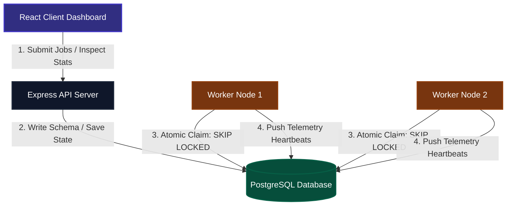

# Architecture Diagram

This is the system architecture showing data flow and service relationships.

### Components
1. **React Client**: User interface where developer triggers and manages workflows.
2. **Express Backend**: Exposes authenticated REST endpoints, parses schemas, validates payloads.
3. **PostgreSQL DB**: Transactional layer coordinating task routing and logs.
4. **Worker Daemon Cluster**: Concurrent consumers claim and run tasks, posting logs back to Postgres.
