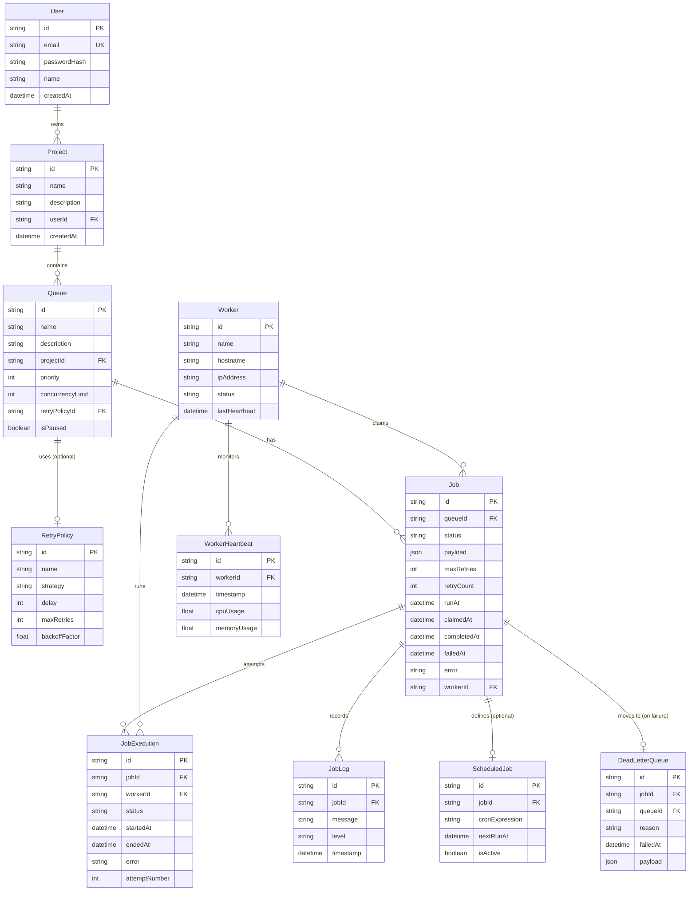

# Database ER Diagram

This is the entity-relationship model of the Distributed Job Scheduler database.

```mermaid
erDiagram
    User {
        string id PK
        string email UK
        string passwordHash
        string name
        datetime createdAt
    }

    Project {
        string id PK
        string name
        string description
        string userId FK
        datetime createdAt
    }

    Queue {
        string id PK
        string name
        string description
        string projectId FK
        int priority
        int concurrencyLimit
        string retryPolicyId FK
        boolean isPaused
    }

    RetryPolicy {
        string id PK
        string name
        string strategy
        int delay
        int maxRetries
        float backoffFactor
    }

    Job {
        string id PK
        string queueId FK
        string status
        json payload
        int maxRetries
        int retryCount
        datetime runAt
        datetime claimedAt
        datetime completedAt
        datetime failedAt
        string error
        string workerId FK
    }

    Worker {
        string id PK
        string name
        string hostname
        string ipAddress
        string status
        datetime lastHeartbeat
    }

    WorkerHeartbeat {
        string id PK
        string workerId FK
        datetime timestamp
        float cpuUsage
        float memoryUsage
    }

    JobExecution {
        string id PK
        string jobId FK
        string workerId FK
        string status
        datetime startedAt
        datetime endedAt
        string error
        int attemptNumber
    }

    JobLog {
        string id PK
        string jobId FK
        string message
        string level
        datetime timestamp
    }

    ScheduledJob {
        string id PK
        string jobId FK
        string cronExpression
        datetime nextRunAt
        boolean isActive
    }

    DeadLetterQueue {
        string id PK
        string jobId FK
        string queueId FK
        string reason
        datetime failedAt
        json payload
    }

    User ||--o{ Project : owns
    Project ||--o{ Queue : contains
    Queue ||--o{ Job : has
    Queue ||--o| RetryPolicy : "uses (optional)"
    Job ||--o{ JobExecution : attempts
    Job ||--o{ JobLog : records
    Job ||--o| ScheduledJob : "defines (optional)"
    Job ||--o| DeadLetterQueue : "moves to (on failure)"
    Worker ||--o{ WorkerHeartbeat : monitors
    Worker ||--o{ Job : claims
    Worker ||--o{ JobExecution : runs
```
